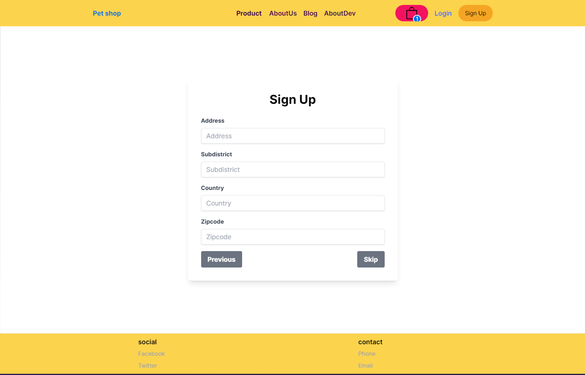

# Project Overview

This project is currently in the development phase, and several features are still under construction. The following screenshots capture the progress of various pages, offering a glimpse into the ongoing work and the project's design.

## Pages

### 1. BlogPage


A dedicated section for blog entries, showcasing various posts and articles.

### 2. DevHistoryPage


This page chronicles the development history, including timelines and key updates.

### 3. LoginPage


The login interface where users can enter their credentials to access the application.

### 4. ProductPage


A product listing page, displaying a variety of items available in the store.

### 5. RegisterPage


The initial registration page for new users to sign up.

### 6. RegisterPage2


An alternative or follow-up registration page for additional user information.

### 7. RegisterPage3


Another variant of the registration page, possibly for a multi-step registration process.

### 8. Screenshot 2024-06-03 130220


A general screenshot captured on June 3, 2024, showcasing one of the application's pages.

## How to Run

To run the project locally, follow these steps:

1. Clone the repository:

   ```bash
   git clone https://github.com/your-repository.git
   ```

2. Navigate to the project directory:

   ```bash
   cd your-repository
   ```

3. Install the necessary dependencies:

   ```bash
   npm install
   ```

4. Start the development server:

   ```bash
   npm start
   ```

5. Open your browser and go to `http://localhost:3000` to view the application.

## Contributing

If you would like to contribute to this project, please follow these steps:

1. Fork the repository.
2. Create a new branch (`git checkout -b feature-branch`).
3. Make your changes and commit them (`git commit -m 'Add some feature'`).
4. Push to the branch (`git push origin feature-branch`).
5. Open a pull request.

## License

This project is licensed under the MIT License - see the [LICENSE.md](LICENSE.md) file for details.
